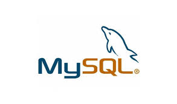

# [alx-backend-storage](https://www.youtube.com/watch?v=3_ZzJJrNCHU) 🏬
> It is widely used as a database component of the software stack for a web application. MySQL Commands are very powerful, and we will look into MySQL commands which are very helpful and consequential for every developer to know and use these queries to interact with the system and MySQL database.
---

